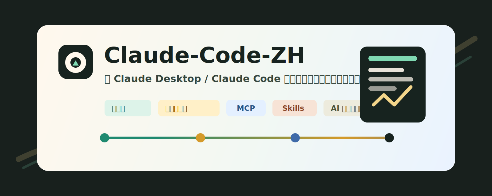

# Claude-Code-ZH



Claude Desktop / Claude Code 中文化、MCP 迁移、skills 同步与第三方模型接入指南。

这个项目不是“一键乱改系统”的脚本包，而是一套可以交给 AI 工具执行的中文实战手册：AI 先读懂目标，再检查环境，再在关键步骤询问你，最后逐步完成安装、备份、配置、验证和回滚准备。

## 本项目能解决什么问题？

### 装了 Claude Desktop / Claude Code，却还是英文？

本项目提供 Claude Desktop 汉化流程：先定位当前安装目录和 JS chunk，备份后只替换完整字符串字面量，修改后用 `node --check` 和日志验证，避免把 Claude 改坏。

### 想在 Claude Code 上使用第三方模型？

本项目整理了 Anthropic 兼容网关接入方式：HTTPS 入口、base URL、是否带 `/v1`、模型别名、API key、流式和非流式请求验证，以及 Claude 日志中的健康状态判断。

### MCP 一直 `server disconnected`？

本项目提供 Windows 下的排查路径：`.cmd` 启动方式、stdio JSON-RPC、stdout 脏输出、Python / Node 环境错位、GUI app 环境变量、远程服务不可达和 token 缺失。

### 想把 Codex / OpenCode / 其他 agent 的能力迁到 Claude？

本项目把 MCP 和 skills 拆开处理。MCP 必须先通过 `initialize` 和 `tools/list` smoke test；skills 必须复制为真实目录，不能用快捷方式或 junction 伪装。

### 想把链接发给任意 AI 工具，让它自己配置？

本项目提供 [`AI_AGENT_GUIDE.md`](AI_AGENT_GUIDE.md)、[`AGENTS.md`](AGENTS.md)、[`CLAUDE.md`](CLAUDE.md) 和 [`.github/copilot-instructions.md`](.github/copilot-instructions.md)。AI 工具打开仓库后，会知道该先问什么、能做什么、不能碰什么、如何验证。

## 适合谁？

- 中文 Windows 用户。
- 已安装或准备安装 Claude Desktop / Claude Code 的用户。
- 想让 Claude 使用第三方模型网关的用户。
- 想把 MCP、skills、开发者设置整理成稳定工作流的用户。
- 想把配置工作交给 AI agent，但又不希望它越权乱改的用户。

## 不适合谁？

- 想要完全无人确认的一键安装器。
- 想绕过 Claude 官方安装器或官方账号机制。
- 想把私有 token、skills、MCP 配置直接发布到公开仓库。
- 需要完整 macOS / Linux 版操作手册的用户。本项目当前以 Windows 为主。

## 需要准备什么？

基础必需：

- Windows 10 / 11。
- PowerShell 5.1 或 PowerShell 7。
- Git。
- Node.js 18+。
- 官方 Claude Desktop 或 Claude Code。

按需准备：

- GitHub CLI：需要建仓、推送或接入 GitHub MCP 时使用。
- Python 3.10+：仅当目标 MCP 或工具链依赖 Python。
- Docker：仅当你要自建 NewAPI、LiteLLM、one-api、反代、数据库或其他本地服务。单纯汉化 Claude 不需要 Docker。
- HTTPS 网关：仅当你要让 Claude 接入第三方模型。建议使用域名和有效证书，不建议在 Claude 里直接写裸 IP HTTPS。
- API key：第三方模型、GitHub、搜索服务或其他云 MCP 的凭据。不要提交到仓库。

## 官方入口

- Claude Desktop 下载：[https://claude.com/download](https://claude.com/download)
- Claude Desktop 安装说明：[Install Claude Desktop](https://support.claude.com/en/articles/10065433-install-claude-desktop)
- Claude Code overview：[https://code.claude.com/docs/en/overview](https://code.claude.com/docs/en/overview)
- Claude Code settings：[https://code.claude.com/docs/en/settings](https://code.claude.com/docs/en/settings)
- Claude Code MCP：[https://code.claude.com/docs/en/mcp](https://code.claude.com/docs/en/mcp)
- Claude Desktop Extensions / MCPB：[https://claude.com/docs/connectors/building/mcpb](https://claude.com/docs/connectors/building/mcpb)
- Claude connectors overview：[https://claude.com/docs/connectors/overview](https://claude.com/docs/connectors/overview)

## 把这个项目交给 AI 工具时怎么说？

把仓库链接和下面这段发给 Codex、Claude Code、OpenCode、Copilot 或其他 AI 工具：

```text
请打开这个仓库，先阅读 README.md、AI_AGENT_GUIDE.md、AGENTS.md 和 docs/00-start-here.md。

我要配置 Claude Desktop / Claude Code：检查安装状态，备份配置，按需安装或修复 Claude，汉化界面，配置第三方模型网关，迁移可验证的 MCP，复制可用 skills，并完成验证。

要求：
1. 默认中文回复。
2. 安装软件、写配置、写 API key、修改 Claude app 文件、复制大量 skills、迁移高风险 MCP、重启 Claude、推送 GitHub 前，必须先问我。
3. 不读取、不输出、不提交 secrets、tokens、.env、credentials、private keys、真实 Claude 配置、真实 MCP 配置、真实 skills 和日志。
4. 配置修改前先备份，修改后验证。
5. MCP 必须通过 initialize 和 tools/list，不通过就不要写入正式配置。
6. 汉化只能替换完整字符串字面量，修改后执行 node --check。
7. 最后告诉我做了什么、备份在哪里、验证结果是什么、还有什么没做。
```

## 人工操作路线

1. 先读 [`docs/00-start-here.md`](docs/00-start-here.md)，确认你要做的是汉化、第三方模型、MCP、skills，还是全套。
2. 按 [`docs/01-install-claude.md`](docs/01-install-claude.md) 安装或检查 Claude Desktop / Claude Code。
3. 按 [`docs/02-preparation.md`](docs/02-preparation.md) 准备 Node、Git、可选 Docker、API key、HTTPS 网关和备份目录。
4. 接第三方模型时读 [`docs/03-third-party-models.md`](docs/03-third-party-models.md)。
5. 迁移 MCP / skills 时读 [`docs/04-mcp-and-skills.md`](docs/04-mcp-and-skills.md)。
6. 汉化 Claude Desktop 时读 [`docs/05-i18n.md`](docs/05-i18n.md)。
7. 出错时读 [`docs/06-troubleshooting.md`](docs/06-troubleshooting.md)。
8. 完成前按 [`docs/07-acceptance.md`](docs/07-acceptance.md) 验收。

## 脚本入口

备份 Claude 配置：

```powershell
.\scripts\Backup-ClaudeConfig.ps1 -BackupRoot .\backups
```

测试 stdio MCP：

```powershell
.\scripts\Test-McpServer.ps1 -Command "cmd" -McpArgs @("/c", "context7-mcp.cmd", "--transport", "stdio")
```

dry-run 同步 skills：

```powershell
.\scripts\Sync-ClaudeSkills.ps1 -Source "$HOME\.codex\skills" -Destination "$HOME\.claude\skills" -DryRun
```

dry-run 汉化 Claude app：

```powershell
.\scripts\Patch-ClaudeI18n.ps1 `
  -ClaudeAppRoot "C:\Path\To\ClaudeApp" `
  -TranslationFile .\translations\zh-CN.sample.json `
  -DryRun
```

发布前敏感信息检查：

```powershell
.\scripts\Test-ClaudeProjectHygiene.ps1
```

## 验收标准

完成后应满足：

- Claude Desktop / Claude Code 来自官方安装路径或官方推荐安装方式。
- 关键配置修改前有备份。
- 第三方模型网关通过 `/v1/models` 和 `/v1/messages` 验证。
- MCP 通过 `initialize` 和 `tools/list`。
- skills 是真实目录，且每个目录有 `SKILL.md`。
- 汉化改动通过 `node --check`。
- Claude 重启后日志没有新增致命错误。
- 仓库内没有真实 token、私有配置、私有 skills、日志、网关地址或内网 IP。

## 项目边界

本项目不提供破解、不绕过官方授权、不托管任何私有模型 key，也不保证每个 Claude Desktop 版本的 JS chunk 都完全一致。它提供的是可审计、可回滚、可交给 AI agent 执行的工程流程。
